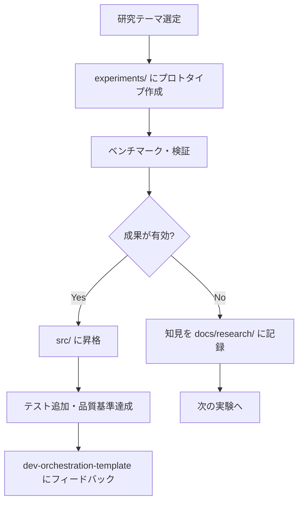
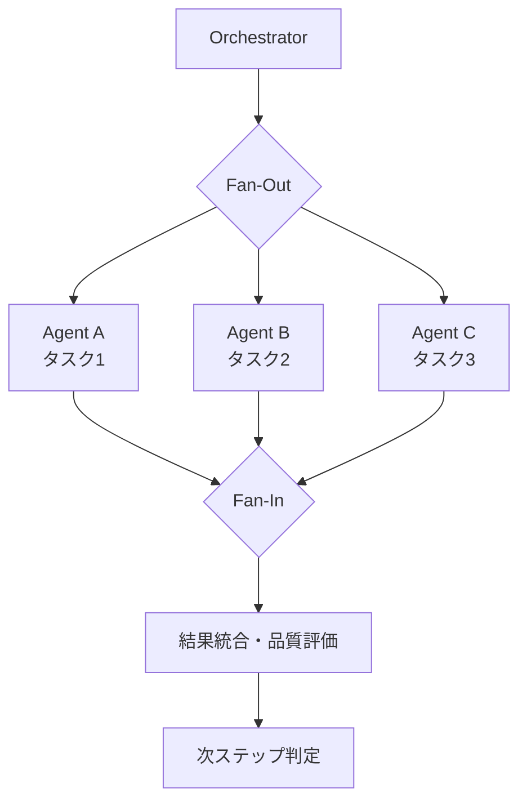

# アーキテクチャ（Architecture）

## 目的

研究・実験と本番品質コードの責務境界を明確にし、成果のフィードバックを容易にする。

## 全体構成

```
ai-orchestration-lab/
├── experiments/          # 実験コード（品質基準: 緩和）
│   ├── parallel-execution/   # Phase 1: エージェント並列実行
│   ├── typed-orchestration/  # Phase 2: 型安全オーケストレーション
│   ├── eval-framework/       # Phase 3: 品質評価
│   ├── a2a-protocol/         # Phase 4: A2A プロトコル
│   └── ai-gateway/           # Phase 3: AI Gateway
├── src/orchestration_lab/    # 昇格済みコード（品質基準: 厳格）
│   ├── core/                 # 型定義・例外・共通
│   ├── parallel/             # 並列実行フレームワーク
│   └── eval/                 # 品質評価フレームワーク
├── benchmarks/               # パフォーマンスベンチマーク
└── tests/                    # テスト
    ├── unit/                 # 単体テスト（src/ 対象）
    └── integration/          # 統合テスト
```

## モジュール責務

### core/

- **types.py** — 共通型定義（`AgentResult`, `PipelineMetrics`, `ExperimentConfig` 等）
- **exceptions.py** — 例外階層（`LabError` → `ExperimentError` / `ValidationError`）
- **config.py** — TOML 設定読み込み

### parallel/

- **strategies.py** — 並列実行戦略の定義（`ParallelStrategy`, `SequentialStrategy`, `FanOutFanIn` 等）
- **executor.py** — 並列実行エンジン
- **quality.py** — 並列実行時の品質評価

### eval/

- **metrics.py** — パイプライン品質メトリクス定義
- **collector.py** — メトリクス収集
- **reporter.py** — 評価レポート生成

## データフロー

### 実験ライフサイクル



### エージェント並列実行フロー（Phase 1 目標）



## 依存ルール

| モジュール | 依存してよい | 依存禁止 |
|---|---|---|
| core | （なし：最下層） | parallel, eval |
| parallel | core | eval |
| eval | core | parallel |
| experiments/ | core, parallel, eval | （制限なし — 実験コードのため） |

## 品質基準

| 領域 | 型チェック | テスト | lint | ドキュメント |
|---|---|---|---|---|
| `src/` | mypy strict 必須 | 必須 | ruff 必須 | docstring 必須 |
| `experiments/` | 推奨 | 推奨 | ruff 必須 | README 必須 |
| `benchmarks/` | 推奨 | — | ruff 必須 | — |

## フィードバック方針

研究成果を dev-orchestration-template にフィードバックする際の方針：

1. **文書化ファースト**: 実装より先に設計文書・ADR を作成する
2. **段階的統合**: 全機能を一度にフィードバックせず、独立した単位で段階的に統合する
3. **後方互換**: テンプレートの既存機能を破壊しない形で追加する
4. **検証済み**: ベンチマーク・テストで有効性が確認された成果のみフィードバックする

## 不変条件

- 秘密情報をリポジトリに含めない（P-002）
- 実験コードと本番品質コードを混在させない（experiments/ vs src/）
- 制約を回避するコードを書かない（P-003）
