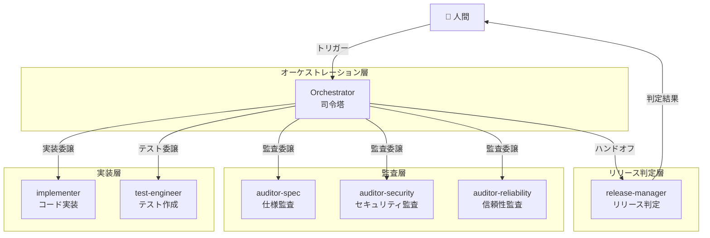
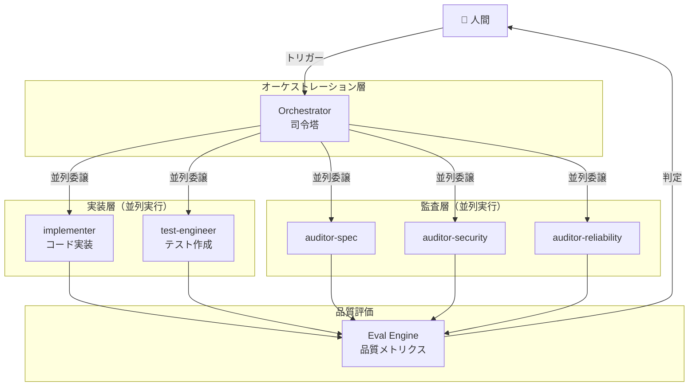
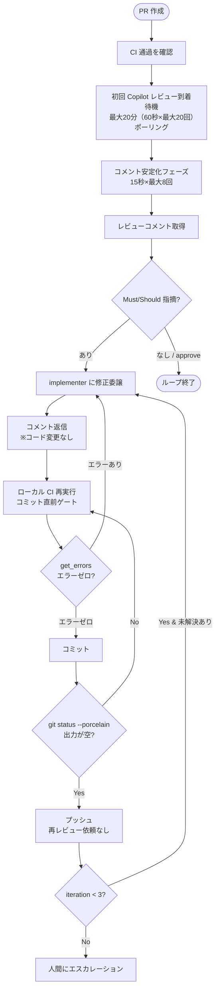

# オーケストレーション構成ドキュメント

> 本ドキュメントは dev-orchestration-template のオーケストレーション設計をベースとし、
> 研究・実験で得た知見を反映して進化させていく文書である。

## 目次

1. [全体アーキテクチャ](#1-全体アーキテクチャ)
2. [エージェント一覧](#2-エージェント一覧)
3. [パイプラインフロー](#3-パイプラインフロー)
4. [エージェント応答スキーマ](#4-エージェント応答スキーマ)
5. [研究テーマ別の設計進化](#5-研究テーマ別の設計進化)
6. [Copilot コードレビュー統合](#6-copilot-コードレビュー統合)
7. [変更履歴](#7-変更履歴)

---

## 1. 全体アーキテクチャ

### 1.1 設計思想

dev-orchestration-template のオーケストレーション設計を継承しつつ、以下の進化を目指す：

- **エージェント並列実行**: 逐次実行から並列実行への移行による品質向上
- **型安全性**: 自然言語ベースからプログラマティック API への段階的移行
- **定量評価**: パイプライン品質の定量的計測と改善サイクル
- **標準プロトコル**: A2A プロトコルによるエージェント間通信の標準化

### 1.2 現行設計（dev-orchestration-template ベース）

### 1.3 目標設計（Phase 1: 並列実行）

---

## 2. エージェント一覧

dev-orchestration-template と同一構成。各エージェント定義は `agents/` を参照。

| エージェント | ファイル | 責務 |
|---|---|---|
| Orchestrator | `orchestrator.agent.md` | パイプライン全体の指揮・統合 |
| implementer | `implementer.agent.md` | コード実装・docs 更新 |
| test-engineer | `test_engineer.agent.md` | テスト作成・実行 |
| auditor-spec | `auditor_spec.agent.md` | 仕様整合性の監査 |
| auditor-security | `auditor_security.agent.md` | セキュリティ監査 |
| auditor-reliability | `auditor_reliability.agent.md` | 信頼性・テスト品質監査 |
| release-manager | `release_manager.agent.md` | リリース可否の最終判定 |

---

## 3. パイプラインフロー

dev-orchestration-template のフローを継承。詳細は `copilot-instructions.md` を参照。

---

## 4. エージェント応答スキーマ

dev-orchestration-template §4 と同一。

---

## 5. 研究テーマ別の設計進化

### 5.1 Phase 1: エージェント並列実行

**研究課題**: 実装時の品質を高めるためのエージェント並列実行戦略

| 比較軸 | 逐次実行（現行） | 並列実行（目標） |
|---|---|---|
| 実装→テスト | implementer → test-engineer | implementer ∥ test-engineer |
| 監査 | 逐次（フレームワーク制約） | 3エージェント並列 |
| 品質 | テストは実装後に作成 | TDD 的アプローチも可能 |
| 所要時間 | 線形積算 | 最長エージェントに依存 |
| トークンコスト | 同等 | コンテキスト重複の可能性 |

**検証ポイント**:
- 並列実行で品質が向上するか（CI 通過率、指摘数で計測）
- コンテキスト共有の問題は発生するか
- Copilot Chat のフレームワーク制約をどう克服するか

### 5.2 Phase 2: 型安全オーケストレーション（将来）

LangGraph + Pydantic AI による §4 応答スキーマの型強制。

### 5.3 Phase 3: Eval & Observability（将来）

パイプライン品質の定量評価と AI Gateway 統合。

### 5.4 Phase 4: A2A & Advanced（将来）

A2A プロトコルによるエージェント間通信の標準化。

---

## 6. Copilot コードレビュー統合

### 6.1 概要

GitHub Copilot Code Review は **PR 作成時に自動トリガーされる初回レビューのみ** を対象とする。
修正 push 後の再レビュー依頼は API 制限により自動化不可能であるため、
**静的解析（CI + get_errors）の通過をもって品質ゲート** とする。

### 6.2 技術的背景（API 制限）

API 経由での Copilot 再レビュー依頼は以下のすべてが失敗する（2025-07 検証済み）：

| 方法 | 結果 |
|---|---|
| REST API `POST /requested_reviewers` | Bot に対しては `requested_reviewers: []`（無視） |
| GraphQL `requestReviews` | Bot ノード ID を User として解決できない |
| dismiss → 再リクエスト | COMMENTED レビューは dismiss 不可（422 エラー） |

唯一の再レビュー手段は GitHub GUI の「Re-request review」ボタンのみ。

### 6.3 設計原則

| # | 原則 | 説明 |
|---|---|---|
| 1 | 初回レビューのみ | PR 作成時の自動トリガーによる初回レビューのみを対象 |
| 2 | 静的解析が品質ゲート | 修正 push 後は CI + get_errors 通過をもって品質を担保する |
| 3 | Bounded Recursion | 初回レビュー指摘への対応は最大3回のイテレーションで制限 |
| 4 | 静的解析ファースト | AI レビューの前に CI + get_errors を必ず通過させる |

### 6.4 レビュー対応フロー

### 6.5 指摘の分類

| 分類 | 対応 |
|---|---|
| **Must** | マージ前に修正必須 |
| **Should** | 強く推奨（時間が許せば修正） |
| **Nice** | 今回はスキップ可 |

---

## 7. 変更履歴

| 日付 | 内容 |
|---|---|
| 2026-03-02 | §6 Copilot コードレビュー統合セクションを新設。レビュー到着待機フロー（20分×ポーリング）を記載。 |
| 2026-03-01 | dev-orchestration-template ベースで初版作成。 |
